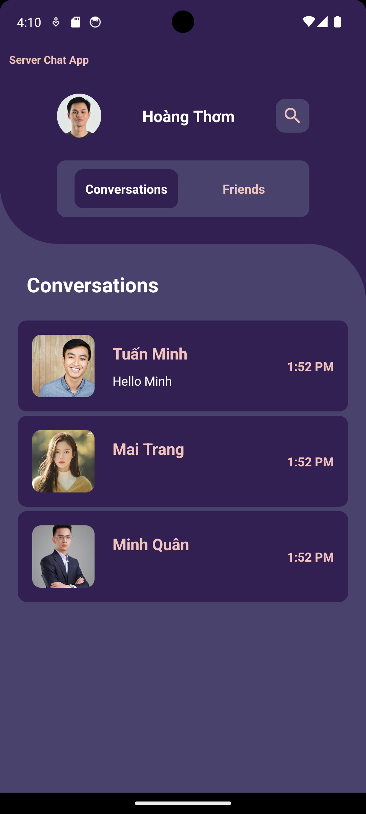

# aidl-communities-app

Server App

      

Create Contact and Search

   

Contact Information
 
                

Client App

   

 
# Technology used:
    ViewBinding
    SQLite
    Rounded Image View
    

# 🌐Socials
    

### ✍️Random Dev Quote

---

